## $ ./intro

Some targets look locked down at first glance. Login page, redirect on every protected URL, role-gated sections marked "Not Authorized." You open Burp, run a few requests, and think *"this is going to be a long day."*

Then you notice that none of the HTTP responses ever return a `302`. And your whole afternoon changes.

This is a writeup of a web application penetration test against an internal manufacturing dashboard — a platform used by engineers, factory leads, and regional teams to track production data, file technical issues, and manage order queues. The application had a multi-role access model with pages supposedly gated behind authorization checks. What it did not have was any of those checks running on the server.

This post covers two chained findings: an application-wide authentication and authorization bypass, and the stored HTML injection that became possible once we were inside. All identifying details have been redacted or replaced.

---

## $ ./initial-recon

The application landed on a clean login page on first visit.

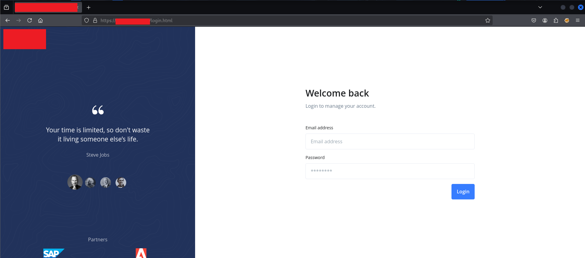

Standard form: email address, password, login button. Clicking the **Dashboards** menu in the navbar while unauthenticated revealed the role model — most sections showed **(Not Authorized)**, with only one area accessible to the test account:

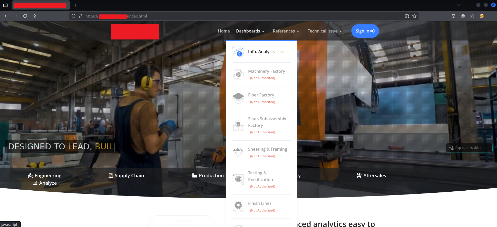

The sections marked "Not Authorized" — Machinery Factory, Fiber Factory, Seats Subassembly Factory, Sheeting & Framing, Testing & Rectification, Finish Lines — were all supposedly inaccessible. The application's visual design communicated a clear access control hierarchy. The question was whether that hierarchy was enforced anywhere that actually mattered.

The first thing to test: navigate directly to a restricted URL while unauthenticated, and watch what the server returns.

---

## $ ./the-assumption-that-broke-everything

When a web application redirects an unauthenticated user to a login page, most developers (and most testers, on a fast day) assume the server is enforcing this with a `302 Found` response. That assumption is usually correct. This time it was not.

I sent a direct `GET` request to a protected dashboard endpoint through Burp's Proxy with the Intercept on:

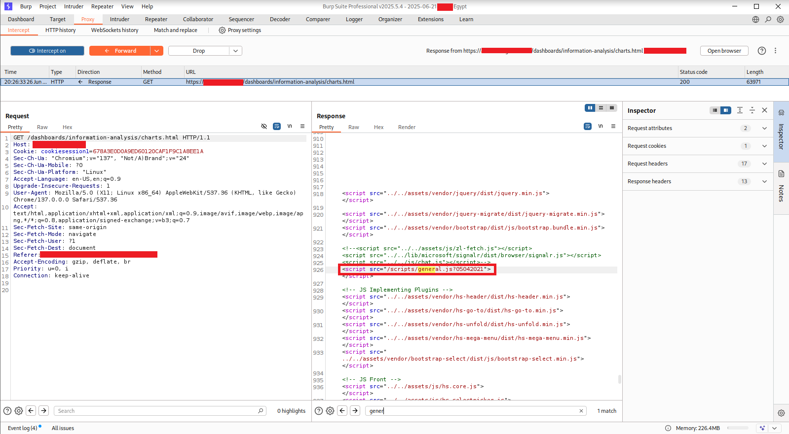

The server's response: `HTTP/1.1 200 OK`. Status code 200. Full HTML body. 63,971 bytes of page content, delivered without any authentication check whatsoever. The server did not know or care that this request was unauthenticated. It returned the page.

So what was producing the redirect to the login page in the browser? The answer was somewhere inside that 63,971-byte response.

Scrolling through the response body in Burp, one particular script tag stood out at line 926:

```html
<script src="/scripts/general.js?05042021"></script>
```

This was the only script that didn't follow the pattern of the vendor libraries loaded above it. All the others were standard third-party scripts — jQuery, Bootstrap, SignalR. This one was application-specific, loaded from `/scripts/`, and had a cache-busting timestamp parameter.

I loaded it directly in a browser tab to read the full source.

---

## $ ./reading-the-watchdog

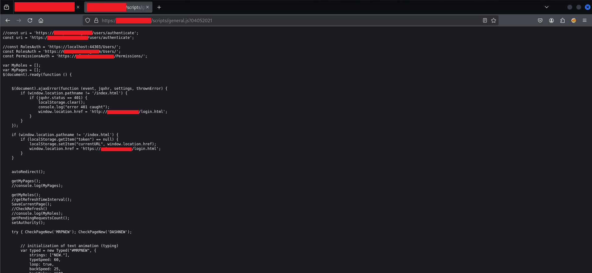

The first lines of `general.js` revealed the entire authentication architecture of the application. Here is the relevant code, cleaned up:

```javascript
// API endpoints for authentication and permissions
const uri = 'https://[REDACTED]/users/authenticate';
const RolesAuth = 'https://[REDACTED]/Users/';
const PermissionsAuth = 'https://[REDACTED]/Permissions/';

var MyRoles = [];
var MyPages = [];

$(document).ready(function () {

    // Handler 1: If any AJAX call returns 401, clear storage and redirect
    $(document).ajaxError(function (event, jqxhr, settings, thrownError) {
        if (window.location.pathname != '/index.html') {
            if (jqxhr.status == 401) {
                localStorage.clear();
                console.log("error 401 caught");
                window.location.href = 'http://[REDACTED]/login.html';
            }
        }
    });

    // Handler 2: If no token in localStorage, save current URL and redirect
    if (window.location.pathname != '/index.html') {
        if (localStorage.getItem("token") == null) {
            localStorage.setItem("currentURL", window.location.href);
            window.location.href = 'https://[REDACTED]/login.html';
        }
    }

    autoRedirect();
    getMyPages();
    getMyRoles();
    SaveCurrentPage();
    setAuthority();
});
```

Reading through this carefully, three structural problems became clear immediately.

**Problem 1: Authentication is a localStorage check, not a server check.** The entire authentication gate is this line:

```javascript
if (localStorage.getItem("token") == null) {
```

The script checks whether a string called "token" exists in the browser's `localStorage`. It does not verify that the token is valid. It does not send the token to the server for validation. It does not check an expiry. The only question it asks is: *does this key exist?* If yes, the user is considered authenticated. A pentester could put the string `"anything"` in `localStorage` and pass this check entirely. In fact, they don't even need to do that — they just need to prevent this script from running.

**Problem 2: The 401 handler only fires on server-side 401 responses.** The `ajaxError` handler would redirect to login if the server returns `401 Unauthorized` on an XHR call. But as we already confirmed, the server was not returning 401 on any of the protected page requests. It was returning 200. So this handler would never fire for page navigation — only potentially for API calls, which we would test separately.

**Problem 3: Role and page authorization are also client-side.** The functions `getMyRoles()` and `setAuthority()` are responsible for fetching the user's roles from an API and then adjusting what the user can see. The pattern this establishes is: *fetch roles, render UI based on those roles, hide things the user shouldn't see.* This is a UI presentation decision, not an access control decision. The underlying API endpoints that return data don't care what roles the caller has — they return data based on the session cookie, and the server trusts that the client will only ask for what it's allowed to have.

The Network tab confirmed which JS file was responsible for the page-level rendering:

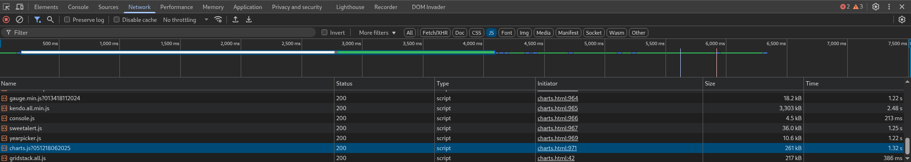

Each protected page loaded its own dedicated JavaScript file in addition to `general.js`. For `charts.html`, the file was `charts.js?051218062025`. I opened it directly.

---

## $ ./the-role-check-that-wasn't

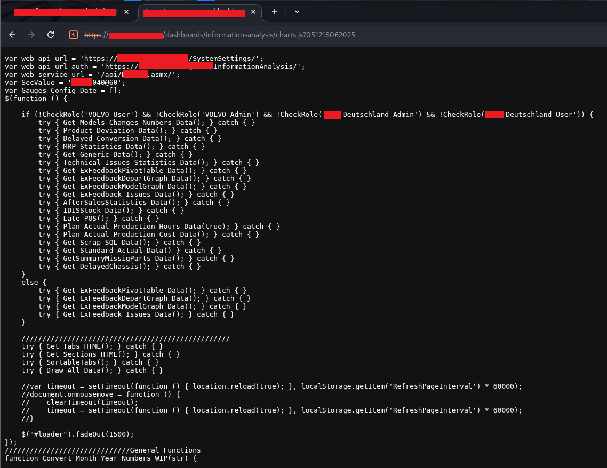

The page-specific JS had its own authorization layer built on top of `general.js`. The core logic:

```javascript
var web_api_url = 'https://[REDACTED]/SystemSettings/';
var web_api_url_auth = 'https://[REDACTED]/InformationAnalysis/';
var web_service_url = '/api/[REDACTED].asmx/';
var SecValue = '[REDACTED]040060';
var Gauges_Config_Date = [];

$(function () {

    // Role check — only load data if the user is NOT in specific roles
    // (i.e., these roles get a restricted view; everyone else gets full data)
    if (!CheckRole('VOLVO User') && !CheckRole('VOLVO Admin') 
        && !CheckRole('[REDACTED] Admin') && !CheckRole('[REDACTED] User')) {

        try { Get_Models_Changes_Numbers_Data(); } catch { }
        try { Product_Deviation_Data(); } catch { }
        try { Delayed_Conversion_Data(); } catch { }
        try { MRP_Statistics_Data(); } catch { }
        try { Get_Generic_Data(); } catch { }
        try { Technical_Issues_Statistics_Data(); } catch { }
        try { Get_ExFeedbackPivotTable_Data(); } catch { }
        try { Get_ExFeedbackDepartGraph_Data(); } catch { }
        try { Get_ExFeedbackModelGraph_Data(); } catch { }
        try { Get_ExFeedback_Issues_Data(); } catch { }
        try { AfterSalesStatistics_Data(); } catch { }
        try { IDISStock_Data(); } catch { }
        try { Late_POS(); } catch { }
        try { Plan_Actual_Production_Hours_Data(true); } catch { }
        try { Plan_Actual_Production_Cost_Data(); } catch { }
        try { Get_Scrap_SQL_Data(); } catch { }
        try { Get_Standard_Actual_Data(); } catch { }
        try { GetSummaryMissigParts(); } catch { }
        try { Get_DelayedChassis(); } catch { }
    }
    else {
        // Restricted role — fewer data functions
        try { Get_ExFeedbackPivotTable_Data(); } catch { }
        try { Get_ExFeedbackDepartGraph_Data(); } catch { }
        try { Get_ExFeedbackModelGraph_Data(); } catch { }
        try { Get_ExFeedback_Issues_Data(); } catch { }
    }

    try { Get_Tabs_HTML(); } catch { }
    try { Get_Sections_HTML(); } catch { }
    try { SortableTabs(); } catch { }
    try { Draw_All_Data(); } catch { }

    // Loader fade-out happens last
    $('#loader').fadeOut(1500);
});
```

This code is architecturally broken in a way that only becomes obvious when you kill `general.js`.

`CheckRole()` is a function defined in `general.js`. It's populated by `getMyRoles()`, which fetches roles from the API and populates the `MyRoles` array. When `general.js` isn't loaded, `CheckRole` is undefined. When `CheckRole` is undefined and you call it, JavaScript throws a `ReferenceError`. The `try { } catch { }` wrapper around every single data-loading function call silently swallows that `ReferenceError`. The entire `if (!CheckRole('...'))` block never evaluates as true — it throws and is caught — and therefore **none of the 20+ data-loading functions execute**.

Additionally, since `general.js` is the file that calls `getMyRoles()`, the `MyRoles` array is never populated, which is why the Console shows exactly what happens when you manually call any function:

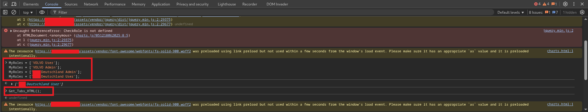

The console shows four `MyRoles = [...]` lines because `getMyRoles()` makes multiple API calls (one per role type) and appends to the array each time. Since we killed `general.js`, those calls never happened, and `MyRoles` stays empty. The console also shows the `Uncaught ReferenceError: CheckRole is not defined` error that explains why the data functions all silently failed.

This is not a minor implementation detail. It means that the entire role-based access system — the logic that decides what production data gets loaded for which user — is entirely dependent on a JavaScript file that the attacker just removed from the equation.

---

## $ ./executing-the-bypass

With a clear understanding of the mechanism, the bypass is almost anticlimactic. In Burp Suite's **Proxy → Match and Replace** settings:

```
Type:     Response body
Match:    src="/scripts/general.js?05042021"
Replace:  src="/scripts/doesnotexist.js"
```

This rule rewrites every HTTP response before the browser parses it, replacing the `general.js` script tag with a reference to a file that doesn't exist. The browser attempts to load the non-existent file, fails silently (a 404 on a script tag doesn't crash the page), and the watchdog never runs.

Now navigate to the restricted `charts.html` page.

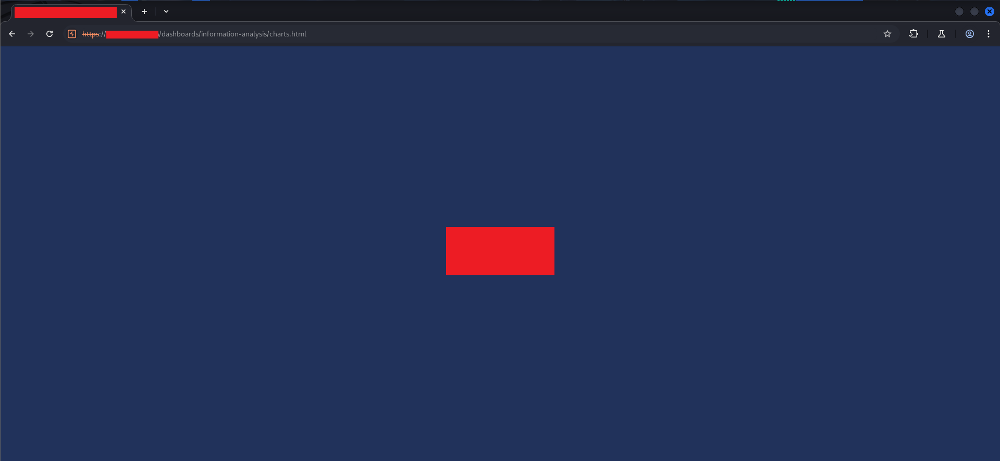

The page loads — the server returns it with `200 OK` as expected — but the UI is blocked by a full-screen dark blue `#loader` div. The loader was designed to sit on top of everything until the data-loading functions completed and called `$('#loader').fadeOut(1500)`. Since we killed `general.js`, those functions never ran, and the loader never fades out.

Looking at the loader in DevTools:

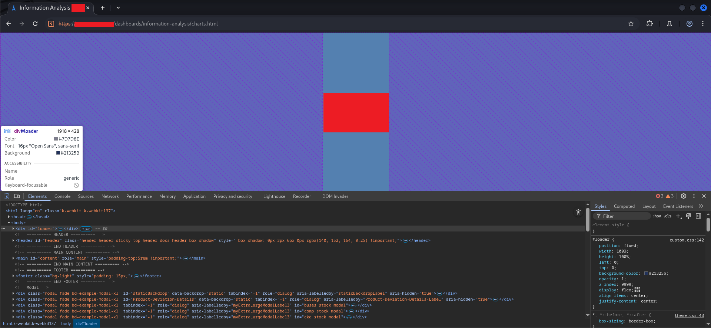

```css
#loader {
    position: fixed;
    width: 100%;
    height: 100%;
    left: 0;
    top: 0;
    background-color: #21325b;
    opacity: 1;
    z-index: 9999;
    display: flex;
    align-items: center;
    justify-content: center;
}
```

`position: fixed`, `z-index: 9999`, covering the full viewport. It's a visual lock, not a functional one. Right-click the element in the Elements panel → Delete element.

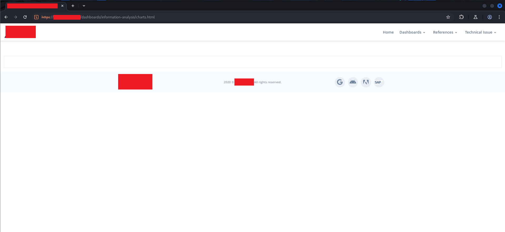

The dashboard structure is now visible. Header, navbar, footer, content area — all there. But the charts and data are empty because none of the data-loading functions ran. The `Customize` button in the top-right corner is visible. The page is interactive.

---

## $ ./loading-the-data-manually

The console is open. The data-loading functions are defined in `charts.js`, which loaded fine. I can call them directly:


```javascript
Get_Tabs_HTML();
```

This call works. The function makes its POST request to the backend, which returns data. Why? Because the server never validated whether the caller had permission to ask for tabs. It just required a valid session cookie, which the browser was sending.

The console output confirms the roles problem: `MyRoles` gets populated only when `getMyRoles()` runs (which normally happens in `general.js`). Since we skipped that, `MyRoles` is empty. But the data APIs don't check `MyRoles`. They don't check roles at all.

Calling `Get_Sections_HTML()` and the other data-loading functions populated the page with real production data from the backend.

---

## $ ./discovering-write-access

With read access confirmed, the next question was write access. The Customize Dashboard feature was visible:

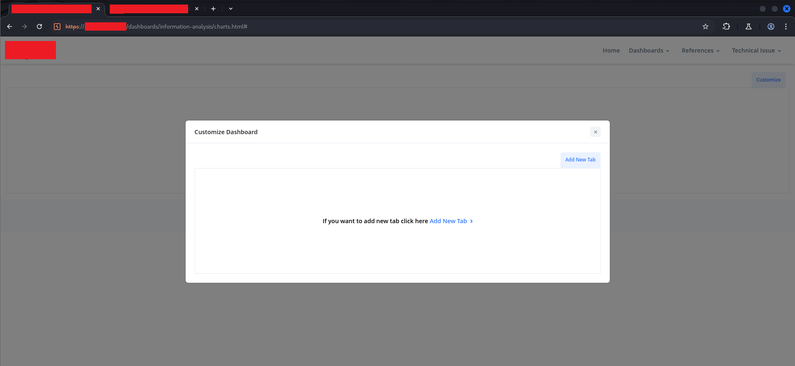

An empty dashboard with an "Add New Tab" button. I clicked through the legitimate flow to create a tab with a benign name to capture the request structure. Looking at the HTTP history in Burp afterward:

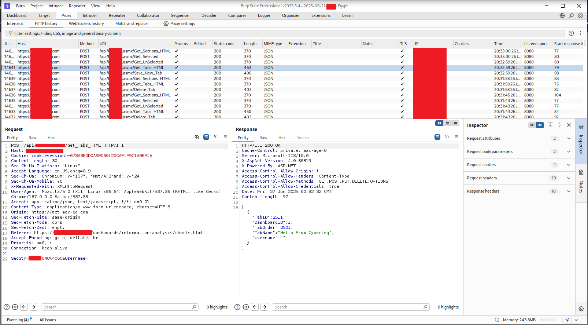

The history showed a sequence of API calls: `Get_Tabs_HTML`, `Save_New_Tab`, `Get_Sections_HTML`, `Get_Selected`, `Get_UnSelected`, `Delete_Tab`. All POSTing to the same `.asmx` API path. All returning `200 OK`. All using only the session cookie for authentication — no additional token, no CSRF protection, no per-endpoint authorization check.

The tab I had created appeared both in the customize modal and in the dashboard header:

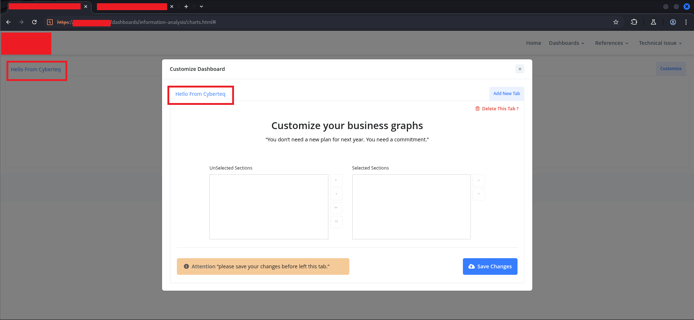

"Hello From Cyberteq" — a plain-text tab name, rendered in a tab button in the header. The question now was obvious: what happens if the tab name isn't plain text?

---

## $ ./part-two-stored-html-injection

### Vector 1: Dashboard Tab Names

I sent the `Save_New_Tab` request to Burp Repeater and modified the `TabName` parameter:

```http
POST /api/[REDACTED].asmx/Save_New_Tab HTTP/1.1
Host: [REDACTED]
Cookie: cookiesession1=[REDACTED]
Content-Type: application/x-www-form-urlencoded

SecStr=[REDACTED]040%4060&DashboardID=1&TabName=<h1>Dedsec+From+CyberTeQ</h1>&Username=
```

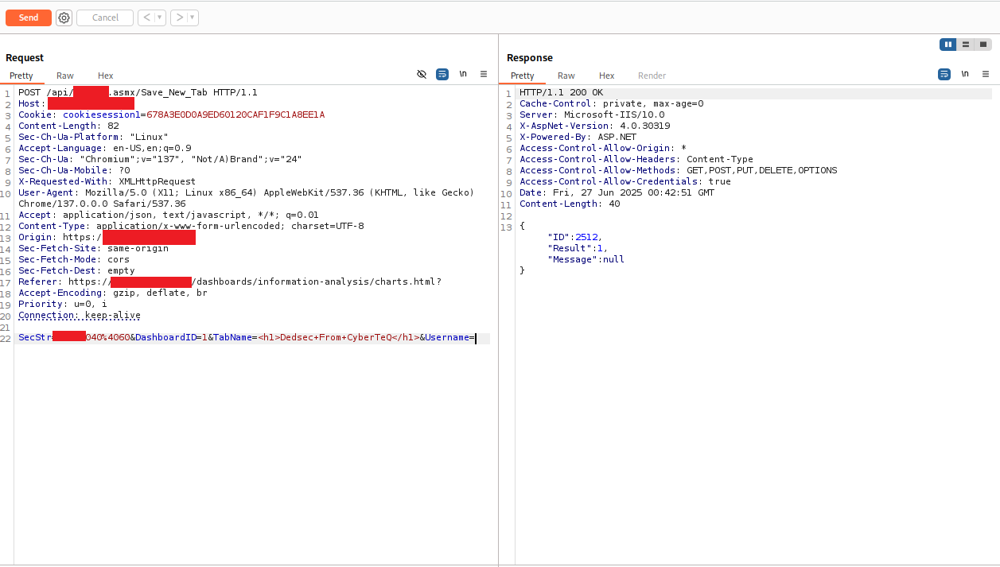

The response came back:

```json
{
    "ID": 2512,
    "Result": 1,
    "Message": null
}
```

`Result: 1` — success. The server accepted the HTML tag in the tab name with no error and no sanitization warning. I then called `Get_Tabs_HTML` to retrieve the stored tabs:

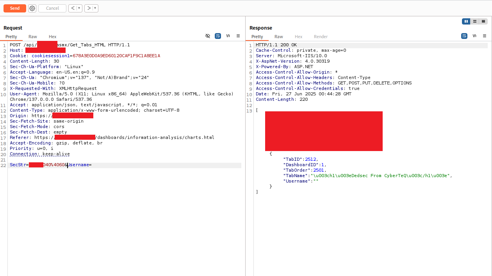

The response body showed the tab returned with its `TabName` value:

```json
{
    "TabID": 2512,
    "DashboardID": 1,
    "TabOrder": 2501,
    "TabName": "\u003ch1\u003eDedsec From CyberTeQ\u003c/h1\u003e",
    "Username": ""
}
```

The `\u003c` and `\u003e` are Unicode escape sequences for `<` and `>`. JSON encoding. This might look like sanitization, but it isn't — it's just how JSON represents angle brackets in string values. The question is what the JavaScript rendering code does with this string when it inserts it into the DOM.

And the DOM rendering code does this (from `charts.js`):

```javascript
// Somewhere in the tab rendering pipeline:
$('#tabs-container').append('<li><a href="#">' + tab.TabName + '</a></li>');
```

jQuery's `.html()` and string interpolation both interpret HTML entities and Unicode escapes as HTML. The `\u003ch1\u003e` becomes `<h1>`, and the browser renders it as a heading element.

The result:

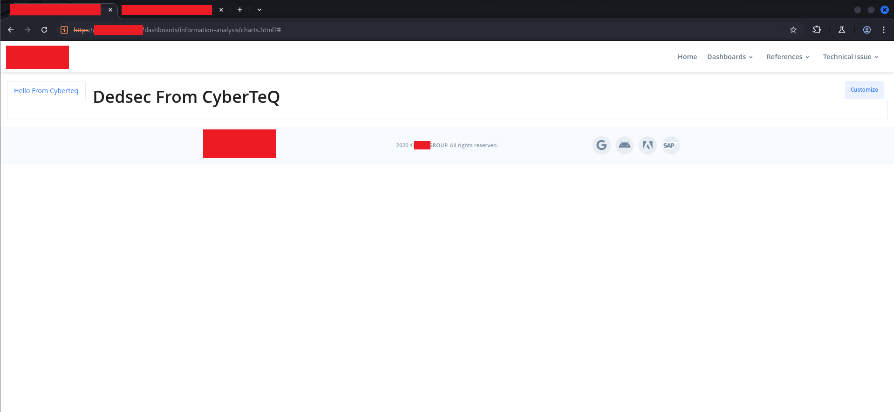

The tab name was injected as a real `<h1>` heading element, displayed prominently in the dashboard header. Every user who visited this dashboard would see this. And because it was server-side stored, it persisted across sessions and browser refreshes until manually deleted.

---

### Vector 2: Technical Issue Descriptions

The second attack surface was the "Compose Technical Issue" workflow — a multi-step form for filing engineering issues against specific production orders.

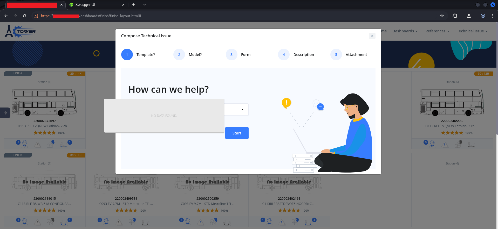

The workflow had five steps: Template, Model, Form, Description, Attachment. Step 4 — Description — used a rich text editor (wysiwyg):

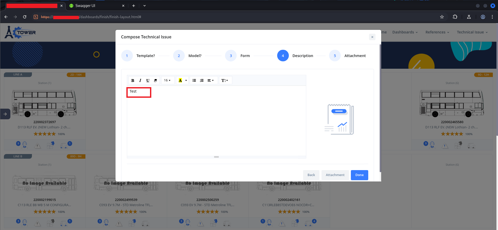

Rich text editors are a classic injection surface because they are explicitly designed to produce HTML output. The question is always: does the server sanitize what they submit, or does it store whatever comes in?

To bypass the multi-step form UI entirely, I intercepted the submission directly in Burp:

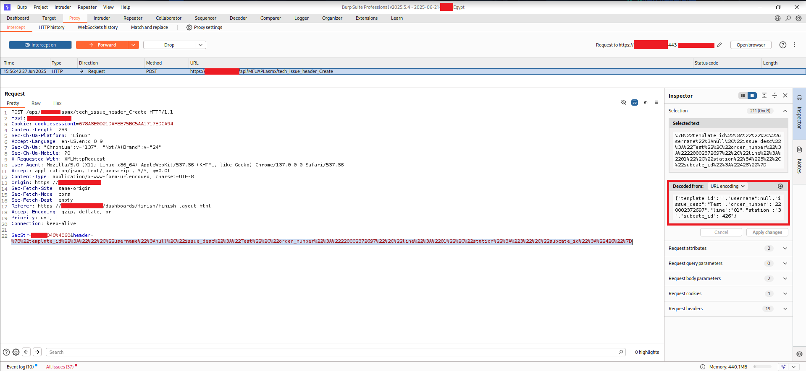

The request body contained a URL-encoded parameter called `header`, whose decoded value was a JSON object:

```json
{
    "template_id": "",
    "username": null,
    "issue_desc": "Test",
    "order_number": "REDACTED",
    "line": "01",
    "station": "3",
    "subcate_id": "426"
}
```

Two fields stood out immediately: `username` (the author name that gets displayed on the issue) and `issue_desc` (the body text). The `username` field was set to `null` in the initial request.

Sending with `username: null` returned an error:

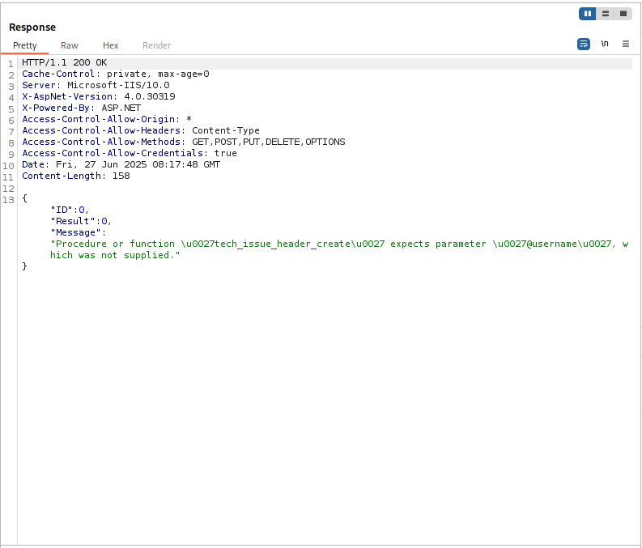

```json
{
    "ID": 0,
    "Result": 0,
    "Message": "Procedure or function 'tech_issue_header_create' expects parameter '@username', which was not supplied."
}
```

This error message reveals something important about the backend: it's built on SQL Server stored procedures (`.asmx` Web Services, ASP.NET 4.x, `X-AspNet-Version: 4.0.30319`). The stored procedure requires `@username` to be a non-null string. But the error is purely a **type validation** — the procedure requires *a* string, not *a specific* or *a sanitized* string. This means any string value will be accepted.

I modified the request:

```json
{
    "template_id": "",
    "username": "Dedsec From CyberTeQ",
    "issue_desc": "<h1>Dedsec</h1>",
    "order_number": "REDACTED",
    "line": "01",
    "station": "3",
    "subcate_id": "426"
}
```

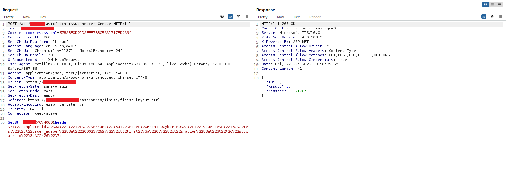

Response:

```json
{
    "ID": 0,
    "Result": 1,
    "Message": "112126"
}
```

`Result: 1`, `Message: "112126"` — the message ID of the newly created issue. Server accepted both the spoofed username and the HTML payload.

The issues now appeared in the Order Issues feed:

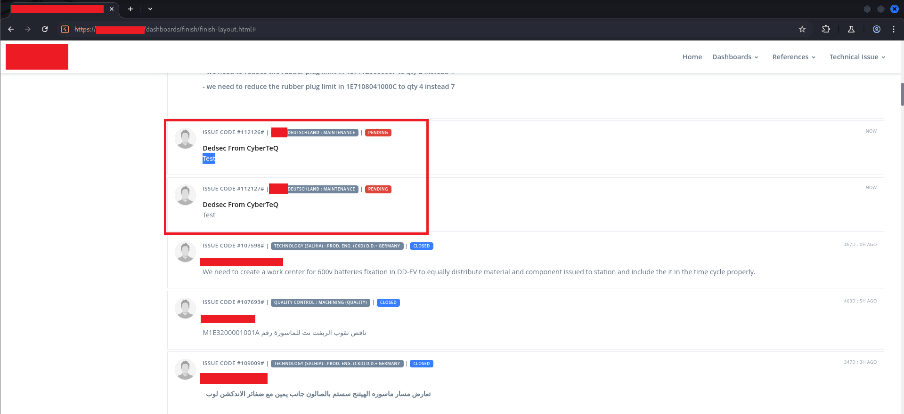

Two issues — `ISSUE CODE #112126` and `ISSUE CODE #112127` — showing "Dedsec From CyberTeQ" as the author, attached to a real production order. The `Test` body rendered in the first one still showed the text literally, because at that point we had tested without the HTML tag. The second one had the HTML.

Opening one of the injected issues showed the full rendering:

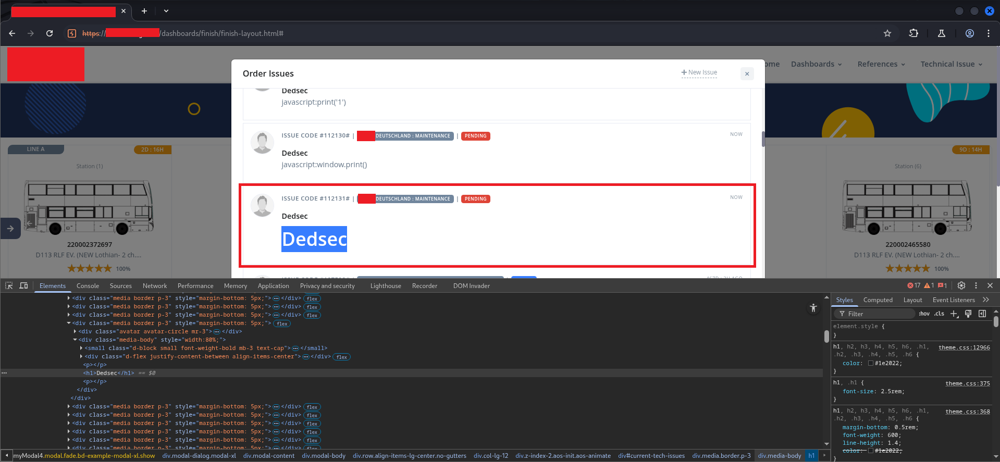

The `<h1>` tag rendered as a styled heading element, visually dominant in the issue body. Looking at the Elements panel at the bottom of the screen confirmed it:

```html
<div class="media-body" style="width:80%;">
    <small class="d-block small font-weight-bold mb-3 text-cap">...</small>
    <div class="d-flex justify-content-between align-items-center">...</div>
    <p><p></p>
    <h1>Dedsec</h1>    <!-- ← our injected element -->
    <p></p>
</div>
```

The `<h1>` was a first-class DOM element, not an escaped string. It received the page's heading styles (`color: #1e2022; font-size: 2.5rem; font-weight: 600`) and rendered visually identically to any legitimate section heading.

The WAF caught `<script>` tags and event handlers like `onerror=`. Even the `javascript:` pseudo-protocol in attributes was filtered. But structural HTML tags — `<h1>`, `<h2>`, `<div>`, `<p>`, `<b>`, `` without event handlers — passed through. Enough to:

- Spoof issue content from any username to any other
- Add fake "URGENT" banners using `<h1>` or `<strong>` styled with `style=` attributes (inline styles were not filtered)
- Embed `<a href>` links pointing to attacker-controlled pages
- Break the visual structure of the issue feed with large elements
- Lay groundwork for phishing within a trusted internal context

---

## $ ./the-full-chain

Putting the entire kill chain in sequence:

```
1. Server returns protected pages with 200 OK — no server-side auth enforcement
         ↓
2. Burp Match-and-Replace kills general.js — browser-side auth logic never runs
         ↓
3. Loader div removed from DOM via DevTools — UI becomes interactive
         ↓
4. Data-loading functions called manually via console — real production data exposed
         ↓
5. Write endpoints (Save_New_Tab, tech_issue_header_Create) accept user-controlled input
         ↓
6. No server-side input sanitization — HTML tags stored and rendered
         ↓
7. Stored HTML injection persists across sessions, visible to all users
```

Each step was possible because of the step before it. Disabling `general.js` only worked because the server didn't enforce auth. Getting write access only worked because the write endpoints had no server-side authorization. The injection only worked because the write endpoints had no sanitization. Strip any one of these and the chain breaks.

---

## $ ./impact

**Confidentiality:** Read access to production dashboards, KPIs, scrap data, engineering issue queues, and order tracking for role-restricted departments — none of which the test account was provisioned to access.

**Integrity:** Ability to create and store content under any username, attached to any production order, without any audit trail connecting the stored content to the actual authenticated session. Engineers reviewing orders would see issues attributed to colleagues who never filed them.

**Availability:** Stored HTML injection with large structural elements or adversarial styling could degrade the usability of shared dashboards for all users, requiring manual cleanup.

The HTML injection is not full XSS — JavaScript execution was blocked by the WAF. But in an internal manufacturing application used for production decision-making, the social engineering potential of spoofed, HTML-formatted issues is significant regardless of whether `<script>` runs. A fake "URGENT — DO NOT SHIP LOT [X]" issue filed under a supervisor's name would be acted on. That's the real impact.

---

## $ ./root-cause

The two vulnerabilities share the same underlying design error: **the trust boundary was placed in the client**.

Every protected page, every role check, every data-rendering decision was conditional on JavaScript that ran in the browser. The server's role was reduced to "return data when a valid session cookie is present." It never asked: "should *this* session see *this* data?" It never asked: "should *this* input be accepted as is?"

This is sometimes called "security through obscurity at the wrong layer" — the controls exist, but they exist somewhere an attacker controls. The browser is not a trust boundary. The attacker controls what code runs in their browser. Any security decision made in client-side JavaScript is a security decision the attacker gets to make.

For the injection specifically: the stored procedure accepted any string as `@username` and any string as `@issue_desc`. The rendering code put those strings directly into the DOM with `.html()`. No output encoding, no allow-listing, no sanitization at either end. The WAF caught the most obvious payloads, but WAFs are not a substitute for output encoding — they're a last-resort layer that can always be bypassed with sufficient creativity.

---

## $ ./recommendations

**1. Enforce authentication and authorization on the server for every request.**
Every API endpoint and every page must validate the session token server-side before returning data. The check must happen in backend code that the caller cannot modify or disable. Client-side role checks can exist for UX purposes (hiding irrelevant UI elements) but must never be the only enforcement layer.

**2. Implement server-side input sanitization and output encoding.**
User-supplied strings must be sanitized before storage and HTML-encoded before rendering. In practice for this application: replace jQuery's `.html(tab.TabName)` with `.text(tab.TabName)`. For rich text scenarios where HTML is genuinely required, use an allow-list-based sanitizer like DOMPurify on the server before storage, not relying on the WAF as the only filter.

**3. Implement a Content Security Policy.**
A properly configured CSP that restricts `script-src` to known origins and disallows inline scripts and event handlers would significantly reduce the impact of any HTML injection that does slip through, and would eliminate the XSS escalation path entirely for future vectors.

**4. Audit all write endpoints for missing authorization checks.**
`Save_New_Tab`, `tech_issue_header_Create`, and the other endpoints in the `.asmx` API surface should verify that the authenticated session has permission to perform the requested operation before executing it — independently of whatever the client-side UI tells the user they're allowed to do.

---

## $ ./takeaways

The most interesting thing about this engagement was how quickly the bypass happened once the first assumption was verified. Opening Burp, intercepting a request to a protected page, seeing `200 OK` — that took about 30 seconds. From there, everything else followed logically.

**For developers:** the instinct to "protect" pages by controlling what the browser renders is understandable. It feels like access control. It works for legitimate users who aren't running a proxy. But it is categorically not access control, and any security review that looks at the server responses will find it immediately.

**For testers:** when a web app redirects you to a login page on every protected URL, check whether that redirect is `302` at the HTTP level or JavaScript at the browser level. In Burp, the distinction is visible the moment you look at the raw response. If the server sends `200 OK` with the full page body, and the redirect is happening in a script tag — you've already found the vulnerability. Everything else is just demonstrating impact.

One Match-and-Replace rule. One DevTools delete. Two console calls. Two unsanitized endpoints.

---

*Follow along on [LinkedIn](https://linkedin.com/in/your-handle) for more offensive security writeups.*
